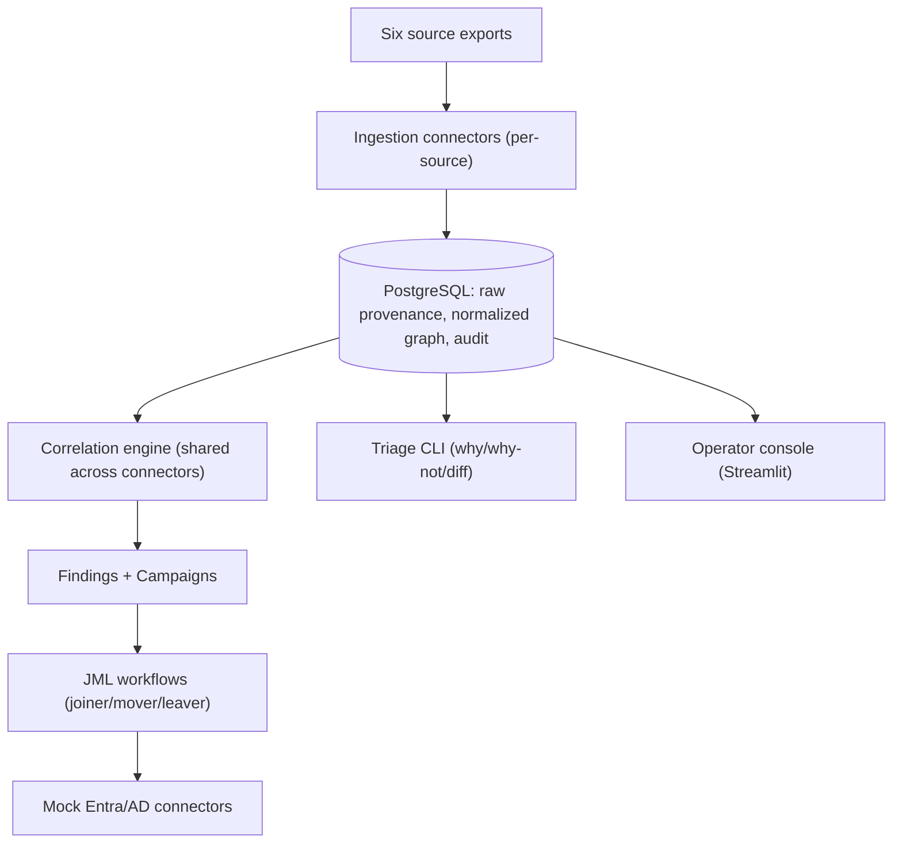

# Architecture

## Runtime topology

## Why this shape

- **One normalized schema, six connectors.** Every source writes into the same
  identity/account/entitlement/application graph rather than maintaining per-source silos,
  which is what makes "show me everything Priya can do" a single query instead of six.
- **Provenance is a first-class table (`source_record`), not a log line.** Every normalized or
  quarantined record traces back to it, which is what makes the reconciliation invariant
  (`rows_in = normalized + quarantined`) mechanically checkable rather than aspirational.
- **Correlation is centralized** (`src/northwind/ingestion/correlation.py`), not reimplemented
  per connector. Each connector supplies its own identifier semantics (email local part,
  samAccountName, IAM username) but scoring, thresholds, and the auto-match/quarantine/
  unmatched decision boundary live in one place.
- **JML is a durable saga** (WorkflowRun/WorkflowStep), not a script. Every step's outcome is
  persisted, so a partial failure is inspectable and a retry only redoes what didn't succeed --
  this is what made the entitlement-revocation bug (see `docs/ai.md`) both possible to
  introduce and possible to definitively verify fixed.
- **Findings and campaigns query the graph directly**, not a separate denormalized store --
  there's one source of truth for "what access exists," which is exactly the property an
  auditor needs.

## Known architectural limitation (found, not hidden)

Re-running ingestion for a source legitimately re-establishes that source's current
group/entitlement memberships as ground truth. If a JML workflow already revoked an
entitlement and a later ingestion re-adds it (because the source system itself still shows the
membership), the JML workflow's own idempotency means it won't automatically re-revoke it --
that entitlement now needs either a new JML trigger or a mover/reconciliation pass. This is a
real interaction between two individually-correct behaviors (ingestion reflects
source-of-truth; workflows don't redo completed work), not a bug in either one alone. A
production system would need a continuous reconciliation loop or a "last-known-desired-state"
concept to fully close this gap; it's called out here rather than glossed over. See
`docs/ai.md` item 4 for how this was discovered.
